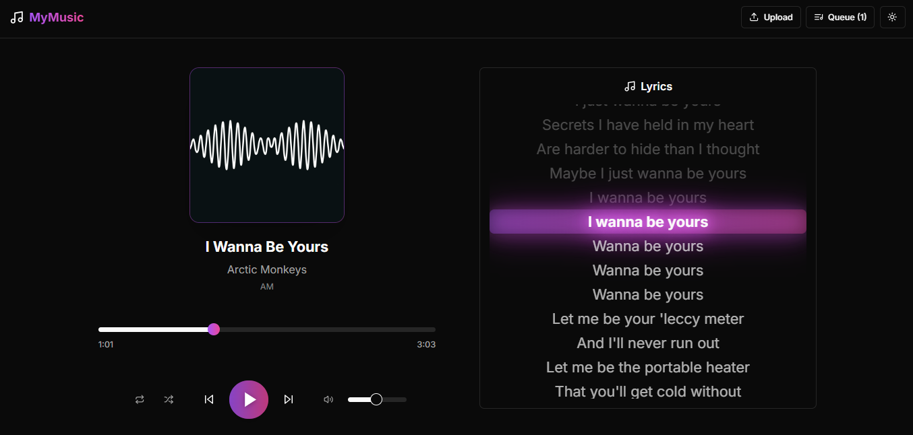

# AI-Powered Music Player

A modern, feature-rich music player web application built using cutting-edge technologies and developed primarily through AI pair programming tools.



## 🤖 AI-Driven Development

This project showcases the power of AI-assisted development, being built entirely through prompting and pair programming with various AI tools:

-   **GitHub Copilot** - AI pair programming assistant
-   **bolt.new** - Rapid prototyping and component generation
-   **Other AI Tools** - Various AI tools for code generation, debugging, and optimization

## ✨ Features

### Music Playback

-   Audio file upload and playback
-   Play/Pause/Skip controls
-   Progress bar with seek functionality and smooth animated seeking
-   Volume control
-   Shuffle and repeat modes (none/one/all)
-   Queue management

### Lyrics

-   Automatic lyrics fetching from multiple sources
-   Line-synced lyrics display
-   Smooth animations and highlighting
-   Subtle glowing effect on current lyric line
-   Fallback to plain lyrics when sync not available
-   Auto-scroll with manual scroll override

### UI/UX

-   Modern, clean interface
-   Unified color palette using Tailwind CSS custom colors
-   JetBrains Mono as the default site font
-   Dark/Light theme support
-   Responsive design
-   Beautiful transitions and animations
-   Album art display with consistent border and color
-   Queue drawer
-   Upload dialog
-   Toast notifications

## 🛠 Tech Stack

### Frontend Framework

-   Next.js 13 (App Router)
-   React 18
-   TypeScript

### State Management

-   Zustand

### Styling

-   Tailwind CSS with custom color palette (primary, secondary, accent, etc.)
-   JetBrains Mono font
-   CSS Variables for theming
-   Framer Motion for animations

### Audio Processing

-   Web Audio API
-   music-metadata-browser
-   @stef-0012/synclyrics

### UI Components

-   Radix UI primitives
-   Lucide icons
-   Sonner for toasts

### Development Tools

-   Bun as package manager
-   ESLint
-   Prettier
-   TypeScript

## ⌨️ Keyboard Controls

### Playback Controls

-   Space/K - Play/Pause
-   Left/Right - Seek 5s backward/forward
-   J/L - Seek 10s backward/forward
-   Shift + Left/Right - Previous/Next track

### Volume Controls

-   Up/Down - Volume up/down
-   M - Mute/Unmute

### UI Controls

-   Q - Toggle queue
-   Y - Toggle lyrics view
-   0-9 - Jump to percentage of song

### Media Keys Support

-   Play/Pause media key
-   Next/Previous track keys
-   Seek forward/backward keys

Note: All shortcuts are disabled when typing in input fields or text areas.

## 🎵 Supported Audio Formats

-   MP3
-   WAV
-   OGG
-   M4A
-   And other browser-supported audio formats

## 🚀 Getting Started

```bash
# Clone the repository
git clone <repository-url>

# Install dependencies
bun install

# Run the development server
bun dev
```

## 🧪 Built with AI Assistance

This project demonstrates the capabilities of AI-assisted development. Every aspect of the application, from architecture decisions to implementation details, was developed through conversation with AI tools. This includes:

-   Architecture planning
-   Component design
-   Feature implementation
-   Bug fixing
-   Code optimization
-   Documentation

## 📝 License

MIT License - feel free to use this project for learning, modification, or as a base for your own applications.

## 🙏 Acknowledgments

-   Thanks to all the amazing open-source projects that made this possible
-   Special thanks to the AI tools that assisted in development
-   Shadcn/ui for the beautiful component system
-   The Next.js team for the fantastic framework
